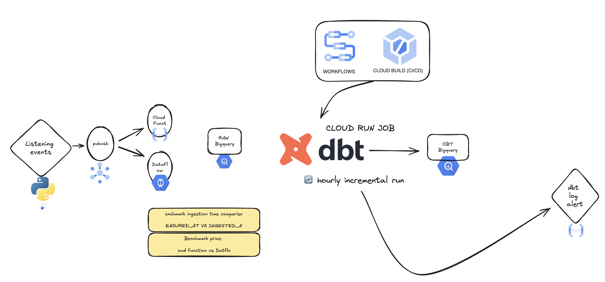

# Streamify GCP - Streaming Solutions Comparison

A data engineering personal project inspired by [ankurchavda/streamify](https://github.com/ankurchavda/streamify), redesigned to compare different GCP streaming solutions for real-time data ingestion. This project helps engineers evaluate Cloud Functions vs Dataflow for their streaming needs while providing real-time monitoring capabilities.

## Project Overview

### Core Purpose
Compare and analyze two different streaming approaches in GCP for real-time data ingestion to BigQuery:
- Cloud Functions (serverless, simple setup)
- Dataflow (managed streaming, scalable)

The project simulates a music streaming service's events to help you make informed decisions about which streaming solution best fits your use case based on:
- Event volume handling
- Latency
- Cost implications
- Scalability

### Key Features
- Simultaneous event streaming to:
  - MQTT broker for real-time monitoring
  - Cloud Pub/Sub for data processing
- Parallel ingestion paths to BigQuery via:
  - Cloud Functions (serverless path)
  - Dataflow (managed streaming path)
- Performance monitoring and comparison metrics
- dbt incremental transformations for analytics

### Architecture


## Quick Start

1. **Environment Setup**
```bash
# Clone and setup
git clone <the repo url>
cd streamify-gcp
python -m venv venv
source venv/bin/activate
```

2. **Configure Environment Variables**
Create a `.env` file with the following variables:
```
PROJECT_ID=your-project-id
PUBSUB_TOPIC=your-topic-name
MQTT_BROKER=your-mqtt-broker
MQTT_PORT=1883
MQTT_TOPIC=your/mqtt/topic
BUCKET_NAME=your-bucket-name
RAW_DATASET=raw_music_event
DBT_DATASET_DEV=streamify_dev
DBT_DATASET_PROD=streamify
```

3. **Deploy Infrastructure**
```bash
./_deploy.sh
```

4. **Generate Events**
```bash
python generate/generate_events.py
```

5. **Monitor Results**
- Use MQTT client to watch real-time events
- Check BigQuery tables for ingested data
- Compare performance metrics between Cloud Functions and Dataflow

## Project Structure
```
streamify_gcp/
├── _deploy.sh              # Infrastructure deployment
├── _init/                  # Schemas and raw data required for initialization
├── generate/               # Event generation
├── transform/              # dbt transformations
└── monitoring/            # Performance monitoring
```

## Use Cases

This project is useful for:
- Learning about GCP's data streaming capabilities
- Understanding real-time data ingestion patterns
- Benchmarking streaming performance

## Getting Started

1. Ensure you have:
   - GCP Account with billing enabled
   - Python 3.9 or higher
   - Google Cloud SDK installed
   - Docker installed (for local development)

2. Follow the Quick Start guide above

## Dashboard & Monitoring


## Acknowledgments
- Original inspiration from [ankurchavda/streamify](https://github.com/ankurchavda/streamify)
- Enhanced with AI tools
